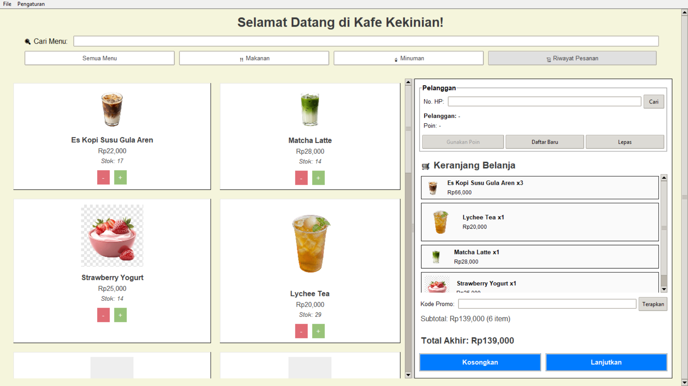
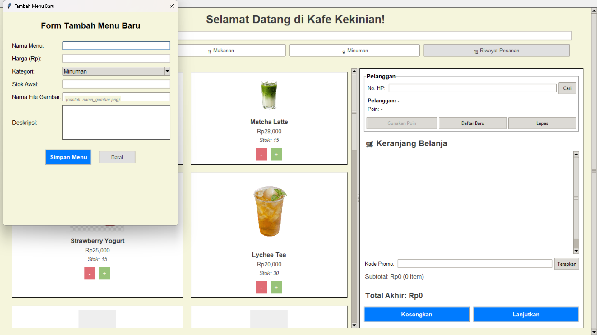
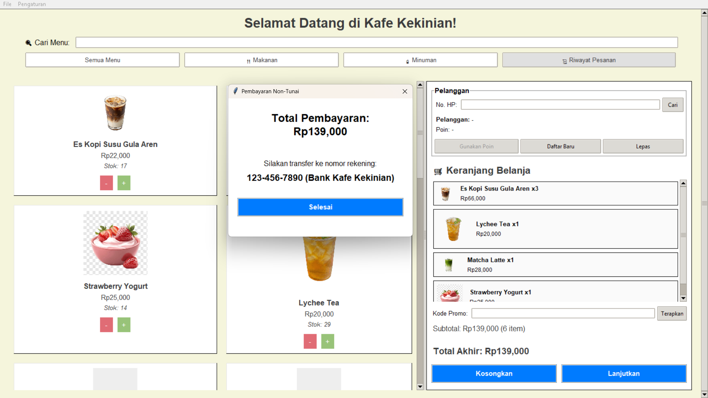
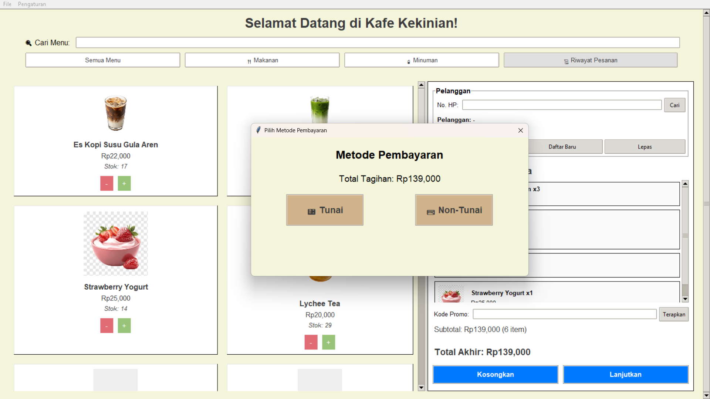

# ☕ Kafe Kekinian — Automated Café POS System

A desktop Point-of-Sale (POS) application for a café, built with **Python & Tkinter**. It's designed to simplify order taking, stock tracking, promo codes, customer loyalty points, and transaction history — all in one clean, cashier-friendly interface.

> This project is a complete starter project, including sample menu data and product images, ready to run right after cloning.

---

## 📸 Screenshots

<table>
<tr>
<td width="50%">

**Main POS screen — menu catalog & shopping cart**


</td>
<td width="50%">

**Add New Menu form (admin panel)**


</td>
</tr>
<tr>
<td width="50%">

**Payment method selection**


</td>
<td width="50%">

**Non-cash payment confirmation**


</td>
</tr>
</table>

---

## ✨ Key Features

- **🛍️ Interactive Menu Catalog** — products displayed as a card grid, complete with images, prices, and live stock status.
- **🔍 Search & Category Filter** — search the menu in real time, or quickly filter between Food and Drinks.
- **🛒 Dynamic Shopping Cart** — add/remove item quantities directly from the catalog, with stock updating automatically.
- **🏷️ Promo Codes** — supports both percentage discounts and fixed-amount discounts (e.g. `HEMAT10`, `NGOPIASIK`, `ALGOPRO123`).
- **⭐ Customer Loyalty Program** — new customer registration, points earned on every transaction, and points redeemable as a discount.
- **💳 Two Payment Methods** — simulated Cash and Non-Cash (bank transfer) payments.
- **📜 Transaction History** — every transaction is saved and can be reviewed in detail, including items, discounts, and points earned.
- **🔐 Protected Admin Panel** — adding, editing, or deleting menu items requires an admin password.
- **🖼️ Image Folder Management** — the product image folder is configurable through a folder-picker dialog, not hardcoded to a single location.

---

## 📂 Folder Structure

```
kafe-kekinian-pos/
├── app.py                  # Main application code (Tkinter)
├── menu_data.json          # Menu data (name, price, description, stock, etc.)
├── config.example.json     # Example format for the image-folder config file
├── image_product/          # Sample product images
│   ├── kopi_susu.png
│   ├── matcha_latte.png
│   ├── strawberry_yogurt.png
│   └── lychee_tea.png
├── docs/                   # Screenshots used in this README
│   ├── main-menu-cart.png
│   ├── add-menu-form.png
│   ├── payment-method-selection.png
│   └── non-cash-payment.png
├── .gitignore
└── README.md
```

> 📝 The files `history.json`, `customers.json`, and `config.json` are **generated automatically** by the application the first time it runs, so they're intentionally excluded from this repo (see `.gitignore`).

---

## 🚀 Getting Started

1. **Clone this repository**
   ```bash
   git clone https://github.com/USERNAME/kafe-kekinian-pos.git
   cd kafe-kekinian-pos
   ```

2. **Make sure Python 3 is installed** (Tkinter usually ships with Python by default on Windows/Mac; on Linux you may need `sudo apt install python3-tk`).

3. **Run the application**
   ```bash
   python app.py
   ```

4. On first launch, the app will ask you to select a **product image folder**. Point it to the `image_product/` folder included in this repo.

---

## 🔑 Admin Access

Some features (add menu, edit menu, delete menu) require an admin password.

- **Default admin password:** `admin123`

> ⚠️ **Important:** This is a default password meant for demo/development purposes only. Be sure to change the `ADMIN_PASSWORD` value in `app.py` before using this app in a real/production environment, since the password is currently stored as plain text in the source code.

---

## 🛠️ Tech Stack

- **Python 3** — core programming language
- **Tkinter / ttk** — desktop GUI
- **JSON** — storage for menu, customer, and transaction history data (no external database required)

---

## 🗺️ Roadmap / Ideas

- [ ] Print receipts to a thermal printer
- [ ] Export sales reports to Excel/PDF
- [ ] Encrypt the admin password (currently stored as plain text)
- [ ] Multi-cashier mode with per-user login

---

## 🤝 Contributing

Pull requests and suggestions are very welcome! Feel free to open an issue if you find a bug or have an idea for a new feature.

## 📄 License

Free to use and modify for learning purposes or further development.
